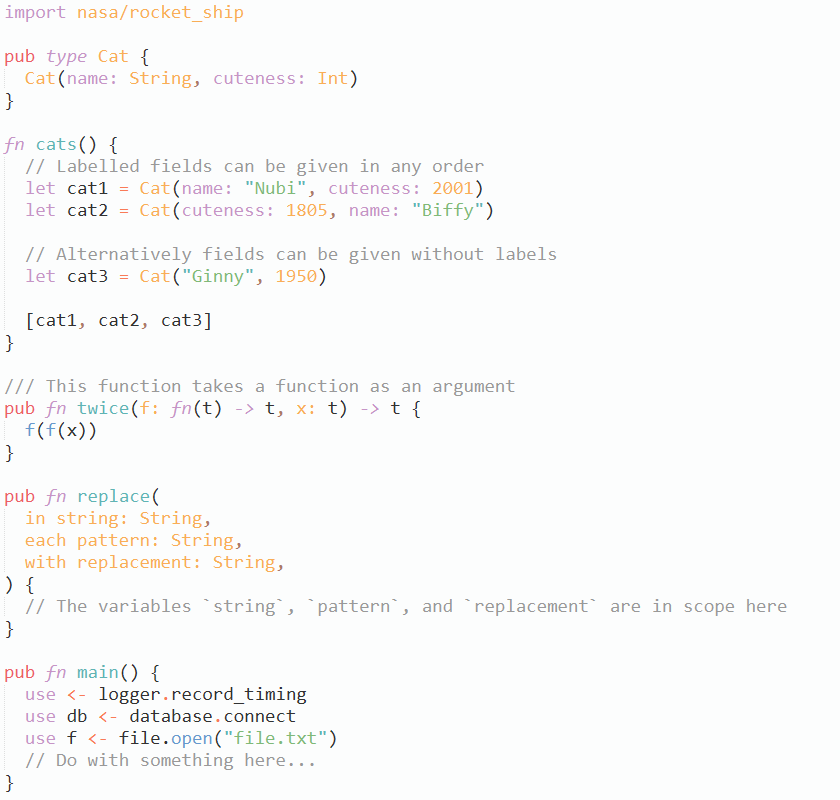
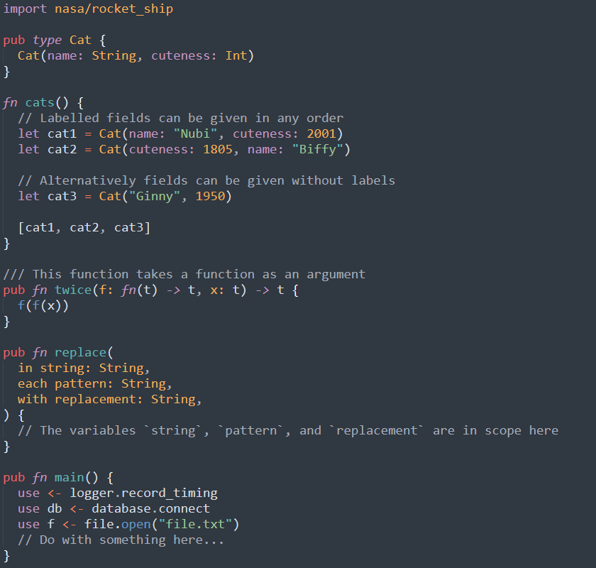

# Sublime Text + Gleam

✨ [Gleam](https://gleam.run) syntax support for Sublime Text.

<p>
  
  
</p>


## Installation

This package is available on
[Package Control](https://packagecontrol.io/installation). To install:

1. Open the command palette (<kbd>Ctrl/Cmd</kbd>+<kbd>Shift</kbd>+<kbd>P</kbd>)
2. Select **Package Control: Install Package**
3. Select **Gleam**


## LSP Integration

The [**LSP**](https://packagecontrol.io/packages/LSP) package enables improved
autocomplete, go-to-definition, formatting, "hover docs", compiler errors and
warnings in the editor, and more. To set it up, install the package and open
its settings (**Preferences: LSP Settings** in the command palette), then add
this config:

```json
{
  "clients": {
    "gleam": {
      "enabled": true,
      "command": ["gleam", "lsp"],
      "selector": "source.gleam"
    }
  },
  "lsp_format_on_save": true
}
```

* If you don't want format-on-save, leave out the global `lsp_format_on_save`
  option (the default is `false`) and instead use **LSP: Format File** in the
  command palette, or bind this to a [keyboard shortcut][LSP-shortcuts].

* If you have Gleam installed using `asdf` or a similar version manager, the
  `command` should instead be e.g. `["~/.asdf/shims/gleam", "lsp"]`.

* If Sublime Text and Gleam are installed in different environments (e.g.
  Sublime on Windows and Gleam on WSL), the LSP package unfortunately won't
  work, since it [does not support][LSP-paths] path translation. Note in the
  specific case of WSL2 you _can_ install Sublime inside the Linux environment
  and [use it that way][WSL-gui], at the cost of some UI quirks.

[LSP-shortcuts]: https://lsp.sublimetext.io/customization/#keyboard-shortcuts-key-bindings
[LSP-paths]: https://github.com/sublimelsp/LSP/issues/535
[WSL-gui]: https://learn.microsoft.com/en-us/windows/wsl/tutorials/gui-apps


## `Fmt` Integration

The **LSP** package (see above) includes code formatting in the editor, but if
you don't want to or can't use the LSP, you can still get formatting using the
[**Fmt**](https://packagecontrol.io/packages/Fmt) package. Follow the
instructions to install it and open the package settings, then add this rule:

```json
{
  "rules": [
    {
      "selector": "source.gleam",
      "cmd": ["gleam", "format", "--stdin"],
      "format_on_save": true,
      "merge_type": "diff",
    },
  ],
}
```

* If you don't want format-on-save, leave out the `format_on_save` option and
  instead use **Fmt: Format Buffer** in the command palette. See the Fmt README
  for instructions on binding this to a keyboard shortcut.

* If you have Gleam installed using `asdf` or a similar version manager, the
  `cmd` should be modified in the same way as the LSP instructions, above. This
  approach also works with WSL (prepend `"wsl"`) or other cases where Gleam and
  Sublime are installed in different environments.


## Compatibility

This package is developed for Sublime Text 4+, and is not available in Package
Control on older versions. It can be installed manually in Sublime Text 3, but
this is unsupported, and bugs that only appear in ST3 will not be fixed.

### Manual Installation

1. Download the `.zip` for the desired version from the GitHub **Releases** page
2. Rename this file (without unzipping it) to `Gleam.sublime-package`
3. Place the file in your Sublime Text "Installed Packages" directory

"Installed Packages" can be found using Preferences → Browse Packages within
Sublime Text (go up one level from the directory this opens).
