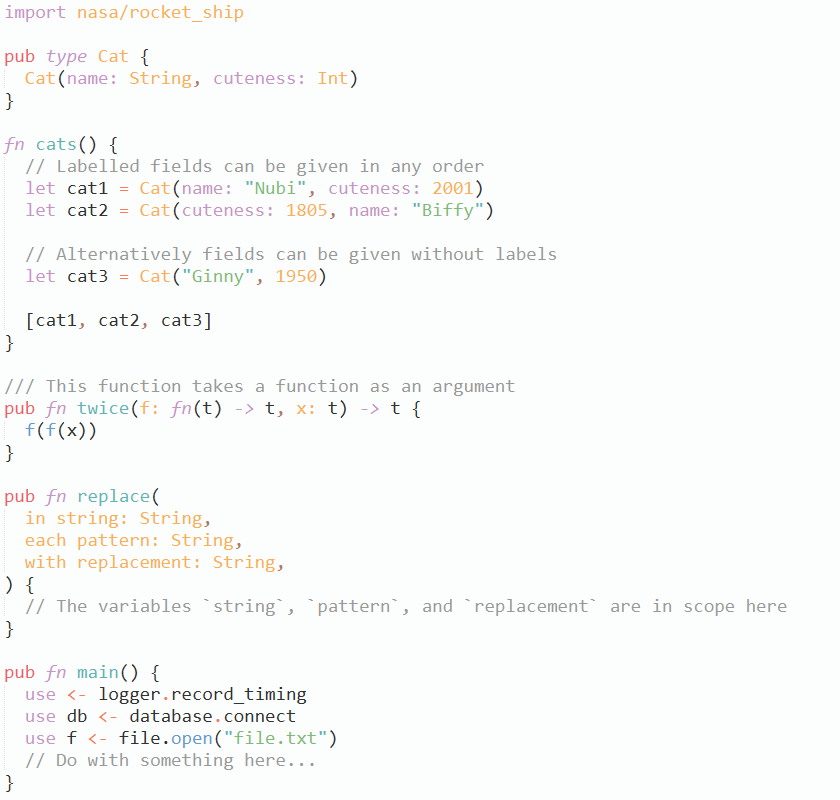
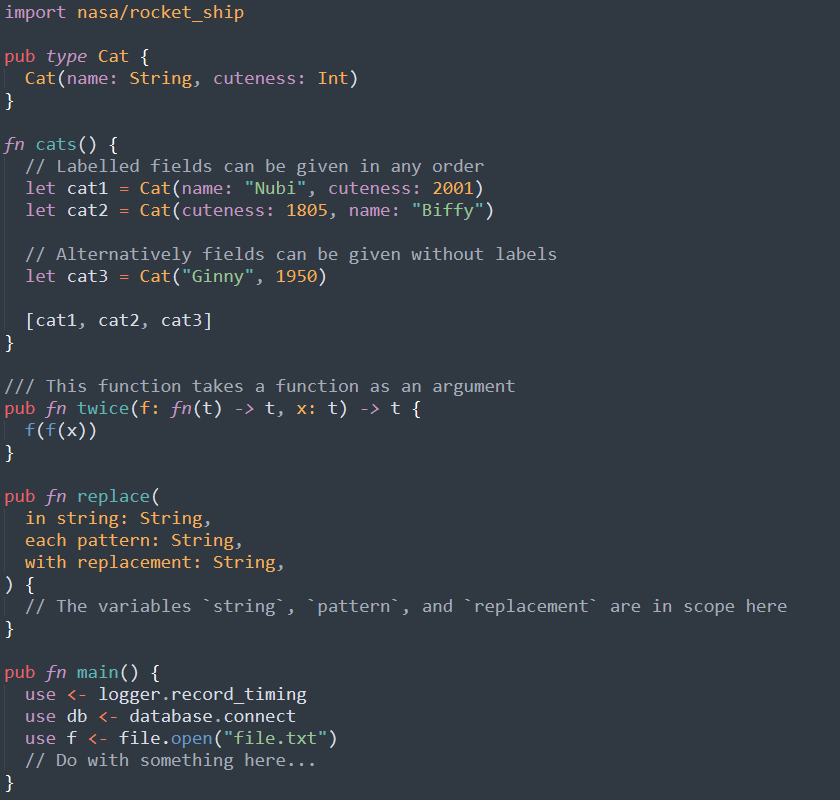

# Sublime Text + Gleam

✨ [Gleam](https://gleam.run) syntax support for Sublime Text.

<p>
  
  
</p>


## Installation

This package is available on
[Package Control](https://packagecontrol.io/installation). To install:

1. Open the command palette (<kbd>Ctrl/Cmd</kbd>+<kbd>Shift</kbd>+<kbd>P</kbd>)
2. Select **Package Control: Install Package**
3. Select **Gleam**

### Language Server

The [Gleam Language Server](https://gleam.run/language-server/) enables improved
autocomplete, go-to-definition, formatting, "hover docs", compiler feedback in
the editor, and more. To set it up, install the [**LSP**][LSP-inst] package and
open **Preferences: LSP Server Configurations** in the command palette, then add
a `gleam` server config:

```json
{
  "gleam": {
    "enabled": true,
    "command": ["gleam", "lsp"],
    "selector": "source.gleam"
  }
}
```

When Gleam is installed using `asdf` or a similar version manager, the `command`
should instead be e.g. `["asdf", "exec", "gleam", "lsp"]`.

**Note:** If using Sublime Text on Windows and Gleam in WSL (or a similar
scenario), the LSP package won't work since it [does not support][LSP-paths]
path translation. In this case, you can still at least get in-editor formatting
using the [**Fmt**](https://packagecontrol.io/packages/Fmt) package; follow its
its instructions to set up a rule with `source.gleam` as the selector and e.g.
`["wsl", "gleam", "format", "--stdin"]` as the command.

[LSP-inst]: https://packages.sublimetext.io/packages/LSP
[LSP-paths]: https://github.com/sublimelsp/LSP/issues/535


## Compatibility

This package is developed for Sublime Text 4+, and is not available in Package
Control on older versions. It can be installed manually in Sublime Text 3, but
this is unsupported, and bugs that only appear in ST3 will not be fixed.

### Manual Installation

1. Download the `.zip` for the desired version from the GitHub **Releases** page
2. Rename this file (without unzipping it) to `Gleam.sublime-package`
3. Place the file in your Sublime Text "Installed Packages" directory

"Installed Packages" can be found using Preferences → Browse Packages within
Sublime Text (go up one level from the directory this opens).
